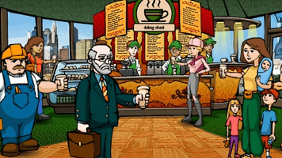

# Cafe Simulation

This program simulates the operations of a coffee shop with multiple baristas and customers. The simulation includes the ordering process, preparation of coffee orders by baristas, and tracking of customer satisfaction.

## Overview

The program uses multithreading and synchronization techniques to model the interactions between customers and baristas in a coffee shop. It includes the following key components:

- **Baristas**: The coffee shop has a specified number of baristas, each identified by a unique ID. Baristas are responsible for preparing coffee orders.

- **Customers**: Customers arrive at the coffee shop, place their orders, and wait for their orders to be prepared. Each customer has a unique ID, a preferred coffee type, an arrival time, and a tolerance time.

- **Coffee Types**: The coffee shop offers various types of coffee, each associated with a preparation time. The program reads this information from the input.

- **Multithreading**: The program utilizes pthreads (POSIX threads) for multithreading. It creates separate threads for baristas and customers to simulate concurrent activities.

- **Synchronization**: Semaphores are used for synchronization between threads. Semaphores ensure that customers place orders only when a barista is available, and baristas start preparing orders only when there are pending orders.

- **Time Tracking**: The simulation tracks the elapsed time in seconds using a timer thread. This helps in coordinating the arrival of customers and the preparation of orders.

## Implementation Details

### Baristas

- Baristas are implemented as individual threads (`thread_of_baristas` function).
- Each barista has an ID and a status (available or busy). The program uses an array (`baristas`) to track the status of each barista.
- Baristas wait for orders to be placed (`sem_wait(&order_sem)`) and start preparing the order once available.

### Customers

- Customers are implemented as individual threads (`thread_of_customers` function).
- Each customer places an order, and the program tracks whether the order is successfully prepared or not.
- Customers wait for their turn to place an order and wait for the order to be prepared.

### Timer Thread

- The timer thread (`timer_thread` function) is responsible for tracking the elapsed time in seconds.
- It increments a global variable (`group[0]`) representing the total seconds elapsed.

### Synchronization

- Semaphores (`order_sem`, `barista_sem`, `customer_order_status`) are used for synchronization between baristas and customers.
- Customers use `sem_wait(&barista_sem)` to ensure that a barista is available before placing an order.
- Baristas use `sem_wait(&order_sem)` to wait for orders to be placed.
- Customer threads signal completion with `sem_post(&customer_order_status)`.

### Input

- The program reads input values to determine the number of baristas, coffee types, and customers.
- It also reads information about coffee types and customer orders.

### Output

- The program outputs information about the arrival of customers, order placement, order preparation, and customer departure.
- Colored ANSI escape codes are used for better visibility of different events.

### Cleanup

- The program performs cleanup by destroying semaphores and joining threads.

## Answers to Questions (Report)

### Question-1:
Waiting Time: Calculate the average time a customer spends waiting for their coffee. Determine if this is more than (and how much) if the cafe had infinite baristas. Coffee prep time is not part of waiting time.

### ANSWER 1:

First, I sum up each customer's waiting time to get the overall amount of time they have to wait. I divide this total waiting time by the total number of customers to get the average waiting time. The following is the computation process:

- The time spent waiting for clients who never witness the beginning of their coffee production is practically equivalent to the time they spent leaving the café.that is, their arrival time less their "arrival time + tolerence time" in the exact next second. To ensure exclusive access to this variable, I increment a global variable with their 'tolerance time + 1'.

- I account for the time consumers spend waiting for the barista when processing their coffee orders. This calculation is done right before the barista starts making coffee.

If there were an infinite number of baristas at the café, the average wait time would be less than a second, as a barista would begin processing a customer's order as soon as they placed it.
As a result, if _'actual waiting time - 1'_, the average waiting times in the two scenarios diverge.

### Question-2:
Coffee Wastage: Determine how many coffees are wasted. Print the number of coffees wasted after the simulation ends.

### ANSWER 2:

When a customer's coffee is served after their tolerance threshold has been reached, this is known as coffee waste. The quantity of coffees that are squandered is tracked by another global variable. When a barista starts processing a customer's order and the consumer decides to depart the shop before their coffee is ready, I increase this count by one.
